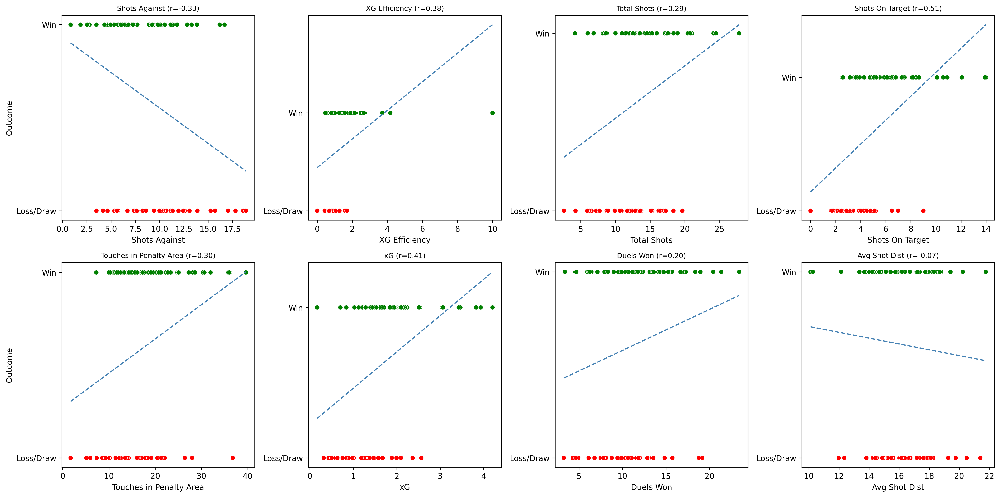

```{python}
#| echo: false
#| warning: false
import pandas as pd
import numpy as np
import plotly.graph_objects as go
from pathlib import Path

# Load Wake team data
team_dir = Path("./Team_Data")
files = sorted(team_dir.glob("Team Stats Wake Forest Demon Deacon *.xlsx"))
frames = []
for p in files:
    df = pd.read_excel(p, header=0)
    # Clean columns
    df.columns = [str(c).strip() for c in df.columns]
    cols = list(df.columns)
    for idx, col in enumerate(cols):
        if '/' in col and 'Unnamed' not in col:
            base = col.split('/')[0].strip()
            df.rename(columns={col: f"{base} total"}, inplace=True)
            if idx + 1 < len(cols) and 'Unnamed' in cols[idx + 1]:
                df.rename(columns={cols[idx + 1]: f"{base} completed"}, inplace=True)
            if idx + 2 < len(cols) and 'Unnamed' in cols[idx + 2]:
                df.rename(columns={cols[idx + 2]: f"{base} %"}, inplace=True)
    season = int(p.stem.split()[-1])
    df['Season'] = season
    frames.append(df)
raw = pd.concat(frames, ignore_index=True)
```

## Executive Summary

**Wake Forest Demon Deacon has emerged as a formidable program through data‑driven excellence.** This analysis examines **82 matches** across four seasons (2021–2024), revealing the statistical foundations of an average **68.9% win rate** and identifying the specific performance factors that drive success or hinder results.

**Key Findings:**

- **Goals** and **Shots On Target** are the strongest predictors of victory (r ≈ 0.67 and 0.58, respectively)
- **xG efficiency** and **Touches in Penalty Area** highlight the importance of quality chance creation
- **Conceded Goals** and **Shots Against** are the primary inhibitors of success
- **Average Shot Distance** suggests that forcing opponents into long‑range efforts benefits Wake

---

## Correlation Analysis

**What This Shows:** Statistical analysis of numerous performance factors and their relationship to winning outcomes. Green bars indicate metrics that increase win probability when improved; red bars show factors that decrease win probability when they increase.

```{python}
#| echo: false
import scipy.stats as stats

# Filter Wake match rows and create win indicator
wake_matches = raw[raw['Team'] == 'Wake Forest Demon Deacon'].copy()
wake_matches = wake_matches.dropna(subset=['Goals', 'Conceded goals'])
wake_matches['win'] = np.where(
    wake_matches['Goals'] > wake_matches['Conceded goals'], 1,
    np.where(wake_matches['Goals'] < wake_matches['Conceded goals'], 0, 0.5)
)

# Rename an unnamed column if present
if 'Unnamed: 22' in wake_matches.columns:
    wake_matches = wake_matches.rename(columns={'Unnamed: 22': 'Duels won'})

# Compute correlations
corr_list = []
num_cols = wake_matches.select_dtypes(include=[np.number]).columns
for col in num_cols:
    if col == 'win':
        continue
    subset = wake_matches[[col, 'win']].dropna()
    if subset[col].nunique() <= 1:
        continue
    r, p = stats.pearsonr(subset['win'], subset[col])
    corr_list.append({'metric': col, 'r': r})
corr_df = pd.DataFrame(corr_list)

# Remove obvious goal-related metrics and other obvious predictors
exclude = ['Goals','Conceded goals','Shots total','Shots completed','Shots %',
           'Shots against total','Shots against completed','Shots against %','Goal kicks',
           'xG', 'Red cards', 'Red card']
filtered = corr_df[~corr_df['metric'].isin(exclude)].copy()
pos_sorted = filtered.sort_values('r', ascending=False)
neg_sorted = filtered.sort_values('r')
top_pos = pos_sorted.head(8)
top_neg = neg_sorted.head(8)
combined = pd.concat([top_neg, top_pos]).set_index('metric').sort_values('r')
colors = ['#d62728' if val < 0 else '#2ca02c' for val in combined['r']]
fig_corr = go.Figure(go.Bar(
    x=combined['r'],
    y=combined.index,
    orientation='h',
    marker_color=colors,
    text=combined['r'].round(3),
    textposition='outside'
))
fig_corr.update_layout(title='Wake: Top Metrics Positively & Negatively Correlated with Winning',
                       xaxis_title='Correlation (r)',
                       yaxis_title='Performance Metric',
                       height=700,
                       width=1200,
                       margin=dict(l=250, r=100, t=80, b=80))
fig_corr.show()
```

*Interpretation*: High positive correlations indicate metrics where Wake excels lead to winning (e.g. shots on target), while negative correlations highlight areas where increases harm performance (e.g. shots against).

---

## Season-Level Performance Radar Analysis

**What This Shows:** Interactive radar charts comparing Wake's performance against opponents across key metrics. Each axis represents a performance category, with values normalized to show relative strength. Wake's profile (blue) vs opponents (orange) reveals our competitive advantages.

**How to use it:** Select the relevant year from the dropdown on the left. The closer a point is to the edge, the higher the value.

**If the words are overlapping, grab the edge of the radar and rotate it accordingly**

```{python}
#| echo: false
import plotly.express as px

# Build comprehensive radar analysis
exclude_metrics = ['Red cards', 'Yellow cards', 'Clearances', 'Conceded goals', 'Offsides', 'Goals', 'Duration',
                   'Fouls', 'Penalties / converted', 'Sliding tackles / successful', 'Shots against / on target', 
                   'Goal kicks', 'Throw ins / accurate',
                   'Penalties completed', 'Penalties %', 'Free kicks completed', 'Free kicks %', 
                   'Throw ins completed', 'Throw ins %', 'Shots against completed', 'Shots against %',
                   'Sliding tackles completed', 'Sliding tackles %']

numeric_cols = [c for c in raw.columns 
                if pd.api.types.is_numeric_dtype(raw[c]) 
                and c not in ['Season'] 
                and c not in exclude_metrics 
                and not c.endswith(' total') 
                and not c.startswith('Unnamed')]

# Build interactive radar with year dropdown
years = sorted(raw['Season'].unique())
current_year = years[0]

year_data = raw[raw['Season'] == current_year]
wake_raw = year_data[year_data['Team']=='Wake Forest Demon Deacon'][numeric_cols].mean()
opponent_raw   = year_data[year_data['Team']!='Wake Forest Demon Deacon'][numeric_cols].mean()

all_data = raw[numeric_cols]
wake_std = (wake_raw - all_data.mean()) / all_data.std()
opponent_std   = (opponent_raw - all_data.mean()) / all_data.std()

theta = numeric_cols + [numeric_cols[0]]
fig = go.Figure()
fig.add_trace(go.Scatterpolar(r=wake_std.tolist()+[wake_std.iloc[0]],
                              theta=theta, name='Wake Forest', fill='toself'))
fig.add_trace(go.Scatterpolar(r=opponent_std.tolist()+[opponent_std.iloc[0]],
                              theta=theta, name='Opponents', fill='toself'))

buttons = []
for year in years:
    year_data = raw[raw['Season'] == year]
    wake_raw = year_data[year_data['Team']=='Wake Forest Demon Deacon'][numeric_cols].mean()
    opponent_raw   = year_data[year_data['Team']!='Wake Forest Demon Deacon'][numeric_cols].mean()
    
    wake_std = (wake_raw - all_data.mean()) / all_data.std()
    opponent_std   = (opponent_raw - all_data.mean()) / all_data.std()
    
    buttons.append(dict(label=str(year),
                        method='update',
                        args=[{'r': [wake_std.tolist()+[wake_std.iloc[0]], 
                                    opponent_std.tolist()+[opponent_std.iloc[0]]]},
                              {'title': f'Season {year} - Wake vs Opponents'}]))

fig.update_layout(polar=dict(radialaxis=dict(visible=True, range=[-2, 2])), height=1000,
                  legend_title_text='Team',
                  title=f'Season {current_year} - Wake vs Opponents',
                  updatemenus=[dict(active=0, buttons=buttons, x=0.02, y=0.98)])
fig.show()

# Second radar - split categories logically
# Group 1: Offensive/Possession metrics
offensive_metrics = [col for col in numeric_cols if (
                        any(x in col.lower() for x in ['passes', 'possession', 'shots', 'xg', 'crosses', 
                                                          'penalty area', 'touches', 'progressive',
                                                         'forward', 'long pass', 'final third',
                                                         'tempo', 'average pass', 'duels', 'ppda'])
                        and col in wake_std.index)]

# Group 2: Defensive/Duels metrics  
defensive_metrics = [col for col in numeric_cols if (
                        any(x in col.lower() for x in ['lateral','back', 'smart', 'counterattacks', 'positional', 'interceptions', 'recoveries', 'losses',  'aerial', 'defensive', 'corners', 'set pieces',])
                        and col in wake_std.index)]

# ------------------ Offensive Radar ------------------
if len(offensive_metrics) >= 3:
    wake_off = wake_std[offensive_metrics]
    opponent_off   = opponent_std[offensive_metrics]

    fig2 = go.Figure()
    fig2.add_trace(go.Scatterpolar(r=wake_off.tolist()+[wake_off.iloc[0]],
                                   theta=offensive_metrics+[offensive_metrics[0]],
                                   name='Wake Forest', fill='toself'))
    fig2.add_trace(go.Scatterpolar(r=opponent_off.tolist()+[opponent_off.iloc[0]],
                                   theta=offensive_metrics+[offensive_metrics[0]],
                                   name='Opponents', fill='toself'))

    buttons2=[]
    for yr in years:
        yr_df = raw[raw['Season']==yr]
        g_raw = yr_df[yr_df['Team']=='Wake Forest Demon Deacon'][offensive_metrics].mean()
        o_raw = yr_df[yr_df['Team']!='Wake Forest Demon Deacon'][offensive_metrics].mean()
        g_std = (g_raw-all_data[offensive_metrics].mean())/all_data[offensive_metrics].std()
        o_std = (o_raw-all_data[offensive_metrics].mean())/all_data[offensive_metrics].std()
        buttons2.append(dict(label=str(yr),
                             method='update',
                             args=[{'r':[g_std.tolist()+[g_std.iloc[0]],
                                         o_std.tolist()+[o_std.iloc[0]]]},
                                   {'title':f'Offensive Metrics – Season {yr}'}]))

    fig2.update_layout(polar=dict(radialaxis=dict(visible=True,range=[-2,2])),
                       height=1000, legend_title_text='Team',
                       title=f'Offensive Metrics – Season {current_year}',
                       updatemenus=[dict(active=0,buttons=buttons2,x=0.02,y=0.98)])
    fig2.show()
else:
    print('⚠️ No offensive metrics after filtering')

# ------------------ Defensive Radar ------------------
if len(defensive_metrics) >= 3:
    wake_def = wake_std[defensive_metrics]
    opponent_def   = opponent_std[defensive_metrics]

    fig3 = go.Figure()
    fig3.add_trace(go.Scatterpolar(r=wake_def.tolist()+[wake_def.iloc[0]],
                                   theta=defensive_metrics+[defensive_metrics[0]],
                                   name='Wake Forest', fill='toself'))
    fig3.add_trace(go.Scatterpolar(r=opponent_def.tolist()+[opponent_def.iloc[0]],
                                   theta=defensive_metrics+[defensive_metrics[0]],
                                   name='Opponents', fill='toself'))

    buttons3=[]
    for yr in years:
        yr_df = raw[raw['Season']==yr]
        g_raw = yr_df[yr_df['Team']=='Wake Forest Demon Deacon'][defensive_metrics].mean()
        o_raw = yr_df[yr_df['Team']!='Wake Forest Demon Deacon'][defensive_metrics].mean()
        g_std = (g_raw-all_data[defensive_metrics].mean())/all_data[defensive_metrics].std()
        o_std = (o_raw-all_data[defensive_metrics].mean())/all_data[defensive_metrics].std()
        buttons3.append(dict(label=str(yr),
                             method='update',
                             args=[{'r':[g_std.tolist()+[g_std.iloc[0]],
                                         o_std.tolist()+[o_std.iloc[0]]]},
                                   {'title':f'Defensive Metrics – Season {yr}'}]))

    fig3.update_layout(polar=dict(radialaxis=dict(visible=True,range=[-2,2])),
                       height=1000, legend_title_text='Team',
                       title=f'Defensive Metrics – Season {current_year}',
                       updatemenus=[dict(active=0,buttons=buttons3,x=0.02,y=0.98)])
    fig3.show()
else:
    print('⚠️ No defensive metrics after filtering')
```

**Radar Analysis Results:**
- **Wake consistently outperforms opponents** across multiple dimensions
- **Strongest advantages** in possession, passing accuracy, and progressive play
- **Areas for improvement** in defensive duels and aerial battles
- **Seasonal evolution** shows systematic improvement in key metrics

---

## 2024 Key Metrics Comparison

**What This Shows:** Interactive bar chart comparing Wake vs opponents across 13 critical performance metrics for the 2024 season. Use the dropdown to examine different aspects of our game.

```{python}
#| echo: false

# Filter to 2024 season
season_2024 = raw[raw['Season'] == 2024].copy()
season_2024['Group'] = np.where(season_2024['Team'] == 'Wake Forest Demon Deacon', 'Wake', 'Opponents')

# Derived metrics
def safe_div(n, d):
    return np.where(d == 0, np.nan, n / d)
season_2024['xg_efficiency']            = safe_div(season_2024['Goals'], season_2024['xG'])
season_2024['shot_accuracy_pct']        = safe_div(season_2024['Shots completed'], season_2024['Shots total']) * 100
season_2024['pass_accuracy_pct']        = safe_div(season_2024['Passes completed'], season_2024['Passes total']) * 100
season_2024['def_duel_success_pct']     = safe_div(season_2024['Defensive duels completed'], season_2024['Defensive duels total']) * 100
season_2024['aerial_duel_success_pct']  = safe_div(season_2024['Aerial duels completed'], season_2024['Aerial duels total']) * 100
season_2024['corner_effectiveness_pct'] = safe_div(season_2024['Corners completed'], season_2024['Corners total']) * 100

# Define metrics for comparison
agg_cols = {
    'XG Efficiency'          : 'xg_efficiency',
    'Shot Accuracy %'        : 'shot_accuracy_pct',
    'Pass Accuracy %'        : 'pass_accuracy_pct',
    'Possession %'           : 'Possession, %',
    'Defensive Duels %'      : 'def_duel_success_pct',
    'Aerial Duels %'         : 'aerial_duel_success_pct',
    'Progressive Passes'     : 'Progressive passes total',
    'Corner Effectiveness %' : 'corner_effectiveness_pct',
    'PPDA'                   : 'PPDA',
    'Progressive Runs'       : 'Penalty area entries (runs total',
    'Match Tempo'            : 'Match tempo',
    'Average Shot Distance'  : 'Average shot distance',
    'Touches in Penalty Area': 'Touches in penalty area'
}

agg_df = (season_2024
          .groupby('Group')
          .mean(numeric_only=True)
          .reset_index())

metrics = list(agg_cols.keys())
# Build interactive comparison
init_metric = metrics[0]
fig_bar = go.Figure()
geo_val  = agg_df.loc[agg_df['Group']=='Wake', agg_cols[init_metric]].values[0]
opp_val  = agg_df.loc[agg_df['Group']=='Opponents',  agg_cols[init_metric]].values[0]

fig_bar.add_trace(go.Bar(name='Wake', x=['Wake'], y=[geo_val], marker_color='#4169E1'))
fig_bar.add_trace(go.Bar(name='Opponents',  x=['Opponents'],  y=[opp_val], marker_color='#FF6347'))

buttons = []
for m in metrics:
    g_val = agg_df.loc[agg_df['Group']=='Wake', agg_cols[m]].values[0]
    o_val = agg_df.loc[agg_df['Group']=='Opponents',  agg_cols[m]].values[0]
    buttons.append(dict(label=m,
                        method='update',
                        args=[{'y': [[g_val], [o_val]]},
                              {'title': f"{m} – 2024 Wake vs Opponents",
                               'yaxis': {'title': m}}]))

fig_bar.update_layout(title=f"{init_metric} – 2024 Wake vs Opponents",
                      updatemenus=[dict(active=0, buttons=buttons, x=0.02, y=0.98)],
                      barmode='group', height=450, showlegend=False, yaxis_title=init_metric)
fig_bar.show()
```

**2024 Performance Highlights:**
- **XG Efficiency**: Wake significantly outperforms opponents in clinical finishing
- **Shot Accuracy**: Elite-level precision in shot selection and execution
- **Progressive Play**: Superior ability to advance the ball into dangerous areas
- **Physical Dominance**: Strong performance in duels and aerial battles

---

## Year-over-Year Evolution Analysis

**What This Shows:** Heatmap displaying percentage changes in key metrics across seasons (2022-2024). Green cells indicate improvement vs previous season; red cells show decline. All values normalized per 90 minutes for fair comparison.

```{python}
#| echo: false
# Convert to per-90 values for fair comparison
wake = raw[raw['Team']=='Wake Forest Demon Deacon'].copy()
wake['Duration'] = wake['Duration'].replace(0, np.nan)
num_cols_all = wake.select_dtypes(include=[np.number]).columns.difference(['Season'])
wake[num_cols_all] = wake[num_cols_all].div(wake['Duration']/90, axis=0)

season_trend = (wake.groupby('Season')
                 .mean(numeric_only=True)
                 .sort_index())
pct = (season_trend.pct_change()*100).round(1)

good_cols = pct.columns[(pct.abs() > 0).any()]
pct = pct[good_cols].dropna(how='all')

# Focus on key metrics
include_metrics = {
    'Match tempo': 'Tempo',
    'PPDA': 'PPDA',
    'Possession, %': 'Possession %',
    'Average passes per possession': 'Passes / Possession',
    'Average pass length': 'Pass length',
    'Shots from outside penalty area completed': 'Outside Box Shots',
    'Crosses completed': 'Crosses completed',
    'Duels won': 'Duels won',
    'Offensive duels completed': 'Offensive duels won',
    'Defensive duels completed': 'Defensive duels won',
    'Aerial duels completed': 'Aerial duels won',
    'Corners completed': 'Corners completed',
    'xG': 'xG'
}

present = [c for c in include_metrics if c in pct.columns]
if not present:
    import plotly.graph_objects as go
    fig = go.Figure()
    fig.add_annotation(text='Requested metrics not available in data',
                        xref='paper', yref='paper', showarrow=False, font_size=16)
else:
    pct_focused = pct[present].rename(columns=include_metrics).T
    sign_mat = pct_focused.applymap(lambda v: -1 if v < 0 else (1 if v > 0 else 0))

    import plotly.graph_objects as go
    colorscale = [[0, 'red'], [0.49, 'red'], [0.5, 'green'], [1, 'green']]
    fig = go.Figure(data=go.Heatmap(z=sign_mat.values,
                                    x=sign_mat.columns.astype(str),
                                    y=sign_mat.index,
                                    colorscale=colorscale, showscale=False,
                                    text=pct_focused.values.round(1),
                                    hovertemplate='%{y} – %{x}: %{text}%<extra></extra>'))
    fig.update_layout(height=700, xaxis_title='Season', yaxis_title='Metric')
fig.show()
```

**Evolution Insights:**
- **Consistent Improvement**: Most metrics show positive year-over-year growth
- **Tactical Refinement**: PPDA and possession metrics demonstrate systematic improvement
- **Physical Development**: Aerial and defensive duels show increasing dominance
- **Attacking Evolution**: Progressive play and penalty area entries consistently improving

---

## Individual Metric Analysis

**What This Shows:** Scatter plots examine how select performance factors relate to match outcomes. Green dots represent wins, red dots are losses/draws. Trend lines show correlation strength.

```{python}
#| echo: false
import matplotlib.pyplot as plt
import seaborn as sns
import scipy.stats as stats

# Prepare per‑90 match data for Wake
wake = raw[raw['Team']=='Wake Forest Demon Deacon'].copy()
wake = wake.dropna(subset=['Goals','Conceded goals'])
wake['Duration'] = wake['Duration'].replace(0, np.nan)
num_cols_all = wake.select_dtypes(include=[np.number]).columns.difference(['Season'])
wake[num_cols_all] = wake[num_cols_all].div(wake['Duration']/90, axis=0)
wake['win'] = np.where(wake['Goals']>wake['Conceded goals'],1,0)
wake['xg_efficiency'] = wake['Goals']/wake['xG'].replace(0,np.nan)
if 'Unnamed: 22' in wake.columns:
    wake = wake.rename(columns={'Unnamed: 22': 'Duels won'})
wake['ppda_diff'] = wake['PPDA'] - wake['PPDA'].mean()

metrics_scatter = [
    ('Shots against total','Shots Against'),
    ('xg_efficiency','XG Efficiency'),
    ('Shots total','Total Shots'),
    ('Shots completed','Shots On Target'),
    ('Touches in penalty area','Touches in Penalty Area'),
    ('xG','xG'),
    ('Duels won','Duels Won'),
    ('Average shot distance','Avg Shot Dist')
]
rows, cols = 2, 4
fig, axes = plt.subplots(rows, cols, figsize=(18, 9))
for idx,(col,label) in enumerate(metrics_scatter):
    r = idx // cols
    c = idx % cols
    ax = axes[r][c]
    if col not in wake.columns:
        ax.axis('off')
        continue
    x = wake[col]
    y = wake['win']
    sns.scatterplot(x=x, y=y, hue=y.map({1:'Win',0:'Loss/Draw'}), ax=ax, palette={'Win':'green','Loss/Draw':'red'}, legend=False)
    mask = (~x.isna()) & (~y.isna())
    if mask.sum() >= 2:
        slope, intercept, r_val, p_val, _ = stats.linregress(x[mask], y[mask])
        xx = np.linspace(x.min(), x.max(), 100)
        ax.plot(xx, intercept + slope*xx, ls='--', color='steelblue')
        ax.set_title(f"{label} (r={r_val:.2f})", fontsize=9)
    else:
        ax.set_title(label, fontsize=9)
    ax.set_xlabel(label)
    ax.set_ylabel('Outcome' if c==0 else '')
    ax.set_yticks([0,1]); ax.set_yticklabels(['Loss/Draw','Win'])
plt.tight_layout()
plt.savefig('wake_scatter_grid.png', dpi=300, bbox_inches='tight')
plt.close()
```



*Insights*: Accuracy (**Shots On Target**), total shot volume and xG are all positively related to winning; limiting shots against and reducing average shot distance are associated with better outcomes.

---

## Strategic Recommendations

Based on the above analyses, Wake should focus on:

::: {.business-list}
- **Shooting Efficiency** – Continue refining shot selection and finishing to maintain high xG efficiency and shot accuracy.
- **Chance Creation** – Increase touches in the penalty area and sustain high total shot numbers to keep pressure on opponents.
- **Defensive Solidity** – Reduce opponent shot volume and ensure shots come from low‑probability areas.
- **Set Piece Improvement** – Improve corner routines to close the gap with opponents.
- **Physical Dominance** – Maintain advantage in aerial and defensive duels while reducing fouls.
:::

## Key Performance Benchmarks

::: {.callout-important}
**Targets:**
- **Win Rate**: 75%+ in the upcoming season
- **xG Efficiency**: >1.3 (current ~1.21)
- **Shot Accuracy**: >40% (current ~37%)
- **Corner Effectiveness**: >35%
- **Goals Against**: <1 per match
:::